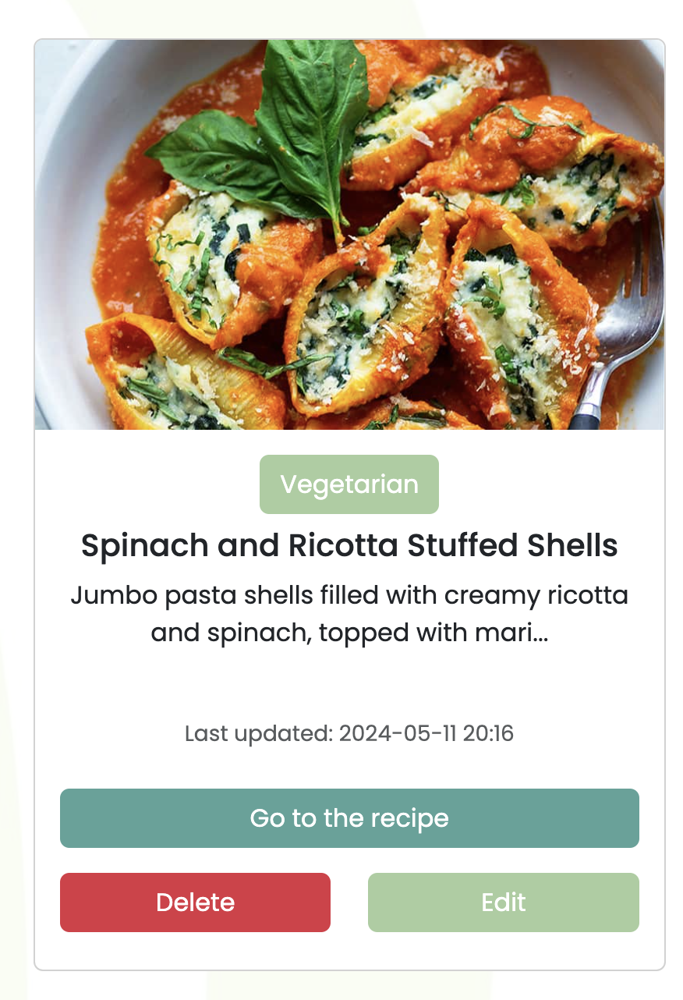

# Wave & Leaf
  * [Live link](https://mp3-waveandleaf-9534ab984761.herokuapp.com/)
  * [Wireframes]() todo 
  * [GitHub Repository](https://github.com/parduckids/milestone-project-three)
  * [Testing docs]() todo testing.md


## The idea: 

* "Wave & Leaf" is a dedicated recipe website designed for the vegan, vegetarian, and pescatarian communities. It offers a rich collection of recipes through a modern and interactive interface, aimed at promoting healthier and more sustainable dietary choices. This platform provides a unique space for users to discover new dishes, share their favorite recipes, and connect with others who share similar dietary interests.

* "Wave & Leaf" is developed as my Milestone Project 3 for the Code Institute's Diploma in Web Application Development course. This project incorporates a range of technologies, including HTML, CSS, JavaScript, Flask, and Jinja templating, backed by an SQL database. These tools were chosen to build this robust and dynamic web app.
---

## Contents
- [User Experience](#user-experience)
  * [User Stories](#user-stories)
    + [New Visitor](#new-visitor)
    + [Registered User](#registered-user)
    + [Recipe Contributor](#recipe-contributor)
    + [Food Enthusiast](#food-enthusiast)
    + [Site Administrator](#site-administrator)
- [Design](#design)
  * [Overview](#overview)
  * [Typography](#typography)
  * [Imagery](#imagery)
  * [Color Scheme](#color-scheme)
  * [Animations and Preloaders](#animations-and-preloaders)
- [Features](#features)
  * [Navigation Bar](#navigation-bar)
  * [Footer](#footer)
  * [User Confirmations](#user-confirmations)
  * [Authentication](#authentication)
  * [CRUD Operations](#crud-operations)
  * [Other Features](#other-features)
- [Extra Features for the Future](#extra-features-for-the-future)
- [Tools & Documentation](#tools--documentations)
  * [Languages Used](#languages-used)
  * [Other Tools](#other-tools)
  * [Design & Image Editing](#design--image-editing)
  * [Documentations](#documentations)
- [Data Model](#data-model)
- [Deployment](#deployment)
  * [Running Locally](#running-locally)
  * [Initial Setup](#initial-setup)
  * [ElephantSQL Database Setup](#elephantsql-database-setup)
  * [Heroku Deployment](#heroku-deployment)
  * [Final Steps](#final-steps)
  * [Additional Information](#additional-information)
- [Credits & Acknowledgements](#credits--acknowledgements)
  * [Credits](#credits)
  * [Acknowledgements](#acknowledgements)

# User Experience
## User Stories

### New Visitor
* As a new visitor, I want to easily navigate the website and understand its purpose from the homepage so I can quickly decide if it meets my needs.
* As a new visitor, I want to be able to browse recipes without registering to see if the site has the types of recipes I'm interested in.

### Registered User
* As a registered user, I want to easily register and log in to the site so I can start uploading and managing my recipes.
* As a registered user, I want to upload recipes under specific dietary categories (vegan, vegetarian, pescatarian) with details like allergens, difficulty, and cooking time to help others make informed decisions.
* As a registered user, I want to edit or delete my recipes after they are posted if I need to update or correct information.
* As a registered user, I want to receive clear confirmation alerts after performing actions (like uploading, editing, or deleting recipes) to ensure that my changes have been successfully applied.

### Recipe Contributor
* As a recipe contributor, I want to include detailed descriptions, ingredients lists, and step-by-step cooking instructions in my recipe uploads to provide clear guidance to others.
* As a recipe contributor, I need to be able to list my name as the creator and track when my recipes were uploaded or last edited for my own records.
* As a recipe contributor, I want to upload images of my cooking directly from my camera, via a link, or by uploading a file, to share my culinary creations with the community.

### Food Enthusiast
* As a food enthusiast, I want to browse recipes by dietary category and view images associated with each recipe, allowing me to visually select dishes that appeal to me.
* As a food enthusiast, I want to save my favorite recipes to my account for easy access later.

### Site Administrator
* As a site administrator, I want to ensure that users can only perform CRUD (create, read, update, delete) operations on recipes they have uploaded themselves to maintain privacy and control over content.

# Design
## Overview
The website design of "Wave & Leaf" features a soothing palette of sea blues and various greens, reflecting its oceanic and botanical themes. The background incorporates a wavy design, subtly alluding to the gentle motion of the sea, aligning with the website's name and focus. This design choice enhances the site’s clear, bright, and friendly atmosphere, making it inviting and easy to navigate. To add to the user experience, "Wave & Leaf" includes beautifully animated pop-ups created using SweetAlert, providing interactive alerts that are both aesthetically pleasing and informative, enriching the overall user interaction and engagement on the site.

## Typography
* I use '[Poppins]' Google Font, which carries the same clean and easy to read design throughout the web app. Its clean lines and minimalistic letterforms create a modern and professional appearance.
* The font is imported from [Google Fonts](https://fonts.google.com/)

## Imagery
**Logo:** <br>


* Made with: [Canva](https://www.canva.com/)
* "Wave & Leaf" uses 'wave' to represent the sea (seafood) for pescatarians and 'leaf' for plant-based ingredients, which summarizes the recipe site tailored to vegan, vegetarian, and pescatarian diets with a focus on natural, wholesome foods.

**Background with Abstract wave-like shapes:** <br>


* I created the background image on [Canva](https://canva.com), a graphic design platform.
* The background features a composition of abstract wave-like shapes, providing a visually attractive, quirky design. The color is changing depending on the recipe category page.

**Recipe Bubbles:** <br>

* Source: [OpenClipart](https://openclipart.org/)
* These recipe category bubbles represent vegan, vegetarian, and pescatarian food.
  
**Recipe Images**
* Source: Various sources, using google image search ([Google](https://google.com/))

**Favicon** <br> <br>

* Made with: [Canva](https://www.canva.com/)
* Conversion to .ico file: [Favicon.io](https://favicon.io/)


## Color scheme

* Deep Blue (#496989): A rich blue that reminds you of the deep sea. It's used for the pescatarian category page, adding a calm and deep look.

* Sea Green (#58A399): A bright and refreshing green. This color is used for the vegan category page, making it feel fresh and lively.

* Light Green (#A8CD9F): A soft, light green that's easy on the eyes. It's used throughout the site, providing a soothing touch.

* Pale Green (#E2F4C5): A very light, almost pastel green. This color is used for the vegetarian pages and for buttons, giving a gentle and inviting vibe.

## Animations and preloaders:

**Preloader with animated dots gif:** <br>

* To ensure that the loading time is less noticeable and maintain the project's cohesive visual theme.
* The preloader using the same colors as the webapp's color scheme


**Hover effects:**
* Normal state: <br> 
* Hover state:<br> 

# Features

## Navigation bar
* Navigation bar when the user isn't logged in yet:
    * Log in and Register buttons are present

* Navigation bar when the user logged in:
    * Log in and Register buttons are hidden, my recipes and upload recipe button and hey 'username' text is present

* Navigation bar on mobile and tablet:

* Navigation bar on mobile and tablet when the user isn't logged in yet:
    * Log in and Register buttons are present

* Navigation bar on mobile and tablet when the user is logged in:
    * Log in and Register buttons are hidden, my recipes and upload recipe button and hey 'username' text is present <br>


## Footer
* Footer:
    * Name, current year(js function), logo(redirects to home page), and github icon with a link to my github profile


* Footer on mobile and tablet: <br>

## Authentication
* Register
    * Registration modal created with bootstrap
    * Placeholder text, labels and close button added for better user experience


* Login
    * Log in modal created with bootstrap
    * Placeholder text, labels and close button added for better user experience


## CRUD Operations
* **Create Recipe**
    * Once the user is logged in, the upload recipe button appears:<br>
    
    * On the upload page, the user can fill up the upload recipe form entries: <br>
    
        * Recipe title
        * Recipe category dropdown (vegan, vegetarian, pescatarian)
        * Recipe difficulty dropdown (easy, medium, hard)
        * Cooking time (user has to enter if it's minutes or hours, users can add extra notes too)
        * Serving (number field)
        * Recipe description
        * Ingredients (all ingredients has to be seperated with a comma to present it as an unordered list)
        * Instructions (Step by step guide, should be seperated by pressing an enter after each step)
        * Allergens (multiple selection field using select2 jQuery replacement select boxes)
        * Upload image button (triggers cloudinary which allows the user to upload images multipe ways)
            * When the user had no image for their recipe, the recipe will be populated with a default image
            


* **Read Recipes** (Recipe Page)<br>

    * This functionality is available all users, logged in or not logged in
    * Recipes can be opened from the category pages or the My Recipes page (for logged in users only ) using the 'Go to the Recipe' button<br>
    

* **Update Recipe** (Edit Recipe Page) <br>
    
    * This functionality can only be used by logged in users
    * The edit recipe page can be reached from the My recipes pages, by choosing a recipe that they want to edit and click on 'Edit' button<br>
    
    * The fields are prepopulated the the values that's been used for the recipe for easier update
    * In this stage, the recipe image can only be changed with a link, Cloudinary isn't available
    * User's have to confirm if they really want to edit the recipe

* **Delete Recipe** <br>
    
    * This functionality can only be used by logged in users
    * The edit recipe page can be reached from the My recipes pages, by choosing a recipe that they want to delete and click on 'Delete' button<br>
    * User's have to confirm if they really want to delete the recipe


## User Confirmations
* All confirmation pop ups are using SweetAlert2 and custom styling
* User Registered: <br>

* User Logged In: <br>

* User Logged Out: <br>

* User Uploading a new recipe: <br>

* User Editing a recipe: <br>

* User deleting a recipe: <br>


## Other Features
* Recipe Category pages
    * Text color is changing depending on the category
    * Bootstrap cards represent recipes with titles, description (with limited letter count, added '...' if too long to keep the styling consistent)
    * Added last updated and creator data to each

    * **Vegan Recipes**
    
        * When this category is empty, show an animated image and some text saying that there isn't available recipe
        
    * **Vegetarian Recipes**
    
        * When this category is empty, show an animated image and some text saying that there isn't available recipe
        
    * **Pescatarian Recipes**
    
        * When this category is empty, show an animated image and some text saying that there isn't available recipe
        
* **My recipes**
    * Once the user is logged in, the 'My recipes' button appears:<br>
    
    * This button will forward the user to their own recipe collection: <br>
    <br>
    * On this page the users can mange the recipes they uploaded, view them edit them or delete them
        * The creator name is removed as it isn't needed anymore
        * Button for edit and delete only available here
    * These recipe cards are different from the category page cards, showing the user the category name (clickable button forwards the user to the category)
    
* **Error handling and user alerts**
    * 404  not found: <br>
    
        * Custom page made for when the user looking for a page that does not exist
            * An animated image added for better user experience
            * A button present to redirect the user to the home page <br>

    * 405 method not allowed:<br>
    
        * This page comes up when the user does not have access to do something, for example:
            * Trying to delete or edit a recipe that isn't uploaded by them
        * An automatic redirect to the home page added with a counter for better user experience
        
    * Wrong username or password: <br>
    
        * This message will pop up when the user is trying to log in with wrong credentials

    * Recipe does not exist: <br>
    
        * This message will pop up when the user is trying get to a recipe that doesn't exist


# Extra features for the future:

### User Experience Features
 * Support for multiple images per recipe
 * Images for each preparation step
 * Filters for cooking time and more
 * Ingredient measurement options
 * Separate entry for each ingredient
 * Recipe sharing feature
 * All Recipes page
 * Favorite Recipes page

### Development Features
 * Admin control over all recipes
 * Admin approval required for recipe visibility; notifications sent
 * Login via email or phone for enhanced security
 * Limit image size to improve load times


# Tools & Documentations

### Languages used:

**[HTML5](https://github.com)**
**[CSS3](https://github.com)**
**[JavaScript](https://github.com)**
**[Python](https://github.com)**

### Other Tools:

**[Flask](https://flask.palletsprojects.com/en/3.0.x/)**
* Flask is a micro web framework written in Python.

**[ElephantSQL](https://www.elephantsql.com/)**
* An advanced open-source database, hosted in the cloud, used for hosting the SQL database.

**[Jinja](https://jinja.palletsprojects.com/en/3.1.x/)**
* The templating language used for Python to add the logic to HTML5

**[Github](https://github.com)**
* Used for version control throughout the whole project

**[GitPod](https://github.com)**
* Used as an online editor to code the project

**[Heroku](https://heroku.com)**
* Used for hosting everything for the project, creating a live link for the users

**[Select2](https://select2.org/)**
* Used to replace the basic multiple select field for better user experience

**[Cloudinary](https://cloudinary.com/)**
* Used for a smoother image upload user experience

**[BCrypt](https://pypi.org/project/bcrypt/)**
* A pip extension for modern password hashing to be used for authentication


### Design & image editing

**[Adobe Photoshop](https://www.adobe.com/)**
* Compressing and resizing images.

**[Techsini Mockup](https://techsini.com/multi-mockup/)**
* Create a multi-screen size screenshot.

**[Real Favicon Generator](https://realfavicongenerator.net/)**
* Creating favicon from an image.

**[MacOS Screenshot & Screen recording](https://support.apple.com/en-gb/guide/mac-help/mh26782/mac)**
* Used for screen recording and screenshots

**[EzGif](https://ezgif.com/video-to-gif/)**
* Used to convert screen recordings to gifs

**[DBDiagram](https://dbdiagram.io/home)**
* Used for creating a visual database model


# Documentations:

* **[Bootstrap docs](https://getbootstrap.com/docs/5.3/getting-started/introduction/)**

* **[Heroku docs](https://devcenter.heroku.com/articles/getting-started-with-python)**

* **[SweetAlert2 docs](https://sweetalert2.github.io/#usage)**

* **[jQuery docs](https://api.jquery.com/)**

* **[Markdown docs](https://www.markdownguide.org/cheat-sheet/)**

# Data Model:
todo
# Deployment:

### Running Locally
```
# allow psql command
set_pg
# get into postgres
psql
# create waveandleaf local database
CREATE DATABASE waveandleaf;
# run script to create categories and basic data
python init_db.py
# run project
python run.py
```

env.py used for running the project locally
```
import os

# Basic application settings and default values
os.environ.setdefault("IP", "0.0.0.0.")
os.environ.setdefault("PORT", "5000")
os.environ.setdefault("SECRET_KEY", "1234")
os.environ.setdefault("DEBUG", "True")
os.environ.setdefault("DEVELOPMENT", "True")
os.environ.setdefault("DB_URL", "postgresql:///waveandleaf")

# bcrypt configuration setting with a default fallback
os.environ.setdefault("BCRYPT_SECRET_KEY", "default_bcrypt_key")
```
## Initial Setup
- The website is built using the [Code Institute's gitpod template](https://github.com/Code-Institute-Org/gitpod-full-template) provided for this project.
- Development was carried out in [Gitpod](https://www.gitpod.io/), an online IDE linked to [GitHub](https://github.com/).

## ElephantSQL Database Setup
- **Navigate to ElephantSQL:** Log in via [ElephantSQL](https://www.elephantsql.com/) using the "Log in" button at the top right corner of the page.
- **Sign in with GitHub:** Choose the GitHub option for authentication and authorize ElephantSQL to access your GitHub account.
- **Create a New Team:** After logging in, add a team name, agree to the Terms of Service, confirm GDPR compliance, and provide your email.
- **Create Database Instance:** Click "Create New Instance", select the "Tiny Turtle" plan, choose a data center, and finalize the instance creation.

## Heroku Deployment
- **Create Heroku App:** Log into [Heroku](https://www.heroku.com/) and create a new app, selecting the nearest region.
- **Configure Database:** In Heroku app settings, reveal and set Config Vars as per the env.py on the local build. Copy the database URL from ElephantSQL to Heroku's DATABASE_URL config var.
- **Connect to GitHub:** In the "Deploy" tab of your Heroku app, connect to your GitHub repository for automatic or manual deployment.
- **Deploy:** Use the "Deploy Branch" button in Heroku to start the build and deploy process.

## Final Steps
- **Post-Deployment Database Setup:** Once deployed, run the necessary database setup commands via Heroku's console to initialize the database schema.
- **Verify Deployment:** Access the app through Heroku's dashboard to ensure it is running correctly.

## Additional Information
- **Requirements and Procfile:** Ensure your project's root directory has a `requirements.txt` and a `Procfile` configured for Heroku deployment.
- **Environment Variables Adjustment:** Adjust environment variables in your Flask application to switch between local and production databases.


# Credits & Acknowledgements

## Credits
- **[Bootstrap](https://getbootstrap.com/)**: For providing the essential tools to craft an intuitive and responsive user interface.
- **[Heroku](https://heroku.com/)**: For their amazing cloud platform that lets me host my app.
- **[ElephantSQL](https://www.elephantsql.com/)**: For their reliable PostgreSQL database hosting service used in this project.
- **[jQuery](https://jquery.com/)**: For their robust library that has enabled me to enhance user interactions on my project.
- **[CodeInstitute](https://codeinstitute.net/)**: For their  [Gitpod template](https://github.com/Code-Institute-Org/gitpod-full-template) that made the coding experience as smooth as possible.
- **[SweetAlert2](https://sweetalert2.github.io/)**: For providing a beautiful, responsive, customizable, and accessible replacement for JavaScript's popup boxes.

## Acknowledgements
* I'd like to thank to my mentor Chris Quinn for helping me make this project better. 
* Also thank you to Code Institute & Bristol College team , especially for Manuel Perez for continuous support. 


**Adam Voros | 2024**